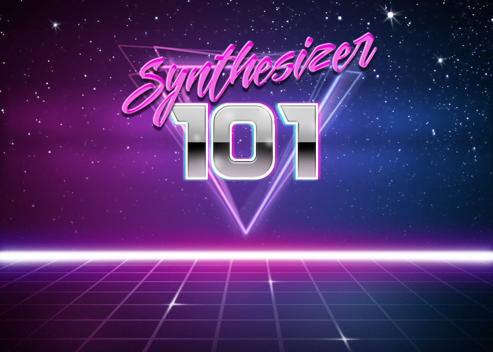

## Ablauf
\begin{itemize}[<+->]
    \item Grundelemente (VCO, LFO ,VCF, VCA ...)
    \item Eurorack
    \item DIY
    \item Minimal Synth
    \item VCVRack
    \item Spielen
\end{itemize}

# Standard Module

## Oszillatoren

* Grundsätzlich 2 Typen 
    * **VCO** (Voltage Controlled Oszillator)
    * **LFO** (Low Frequency Oszillator)
* Grundsätzlich **Sine**, **Rect**, **Triangle** und **Saw**
* Daneben auch Mischungen von obigen.

## VCO
* Im hörbaren Bereich (einige zig Hertz bis einige KiloHertz)
* Spezialfall Waveshape 

## LFO
* VCO in langsam (Weniger als 1 Hertz bis in den unteren hörbaren Bereich)
* Modulierung von Parametern (VCO: FM, VCA: AM)

## VCF
* Voltage Controlled Filter
* Grundsätzlich **High-pass**, **Low-pass**, **Band-pass**
* Grenzfrequenz (**Cutoff**, **Frequecy**): Frequenz ab der der Filter wirkt
* Resonanz (**Resonance**, **Q**): Eine Verstärkung an der Grenzfrequenz
* BP ist ein HP und ein LP
* Je nach dem Selbstoszillation

## Filter: Highpass
\center{
    \includegraphics[width=.7\textwidth]{images/highpass.png}
}

## Filter: Lowpass
\center{
    \includegraphics[width=.7\textwidth]{images/lowpass.png}
}

## Filter: Bandpass
\center{
    \includegraphics[width=.7\textwidth]{images/bandpass.png}
}

## VCA
* Voltage Controlled Amplifier
* Ein "einfacher" Verstärker

## Envelope
* Steuern Amplitudenverlauf eines Signals bei einem Tastenanschlag
* Grundsätzlich ADSR (**Attack**, **Delay**, **Sustain**, **Release**)

## Envelope
\center{
    \includegraphics[width=.7\textwidth]{images/ADSR.jpg}
}

## Weiteres

* Tastaturen
* Sequencer
* Mixer
* Audio / MIDI Interfaces

## Eurorack

## Übersicht

* Modular Synths gibts seit es Synths gibt
* Doepfer A-100 löste Eurorack Boom aus
* Tausende verschiedene Module

## Specs

* ca. 3U (Rackunits) hoch: 128,5mm
* ein mehrfaches von 5.08mm breit (HP)
* Speisung +12V, -12V, 0V, 5V
* Flachbandkabel Stecker

## CV / Gate

* +5V bis -5V bei LFOs
* 0V bis etwa 10V bei sonstigen CVs
* Gate (digitales Signal) bei ca 3V ein (CMOS)
* In der Realität ein Chaos

## Audio Level
* Internes Level wie CV 0V bis 10V
* Mono
* Amps am Eingang
* Dämpfung am Ausgang

# DYI

## Übersicht
* Durch offene Specs grosse DYI Szene
* Full kits
* Vorgelötete Kits
* PCB / Blenden
* Kits bei denen die wichtigsten Teile dabei sind

# Minimal Synth

## Übersicht
* Semimodulares Kit
* Basierend auf den AS33xx Chips (CEM 33xx Klone)
* Nacktes PCB
* Teilbar in die einzelnen Module
* In ein Eurorack einbaubar
* Low Cost 

## Module
* 5V Versorgung
* Arduino Sequencer
* VCO
* LFO/VCO
* Envelope
* VCF
* VCA

# VCVRack

## Übersicht
* Open Source Software
* Virtuelles Eurorack
* Unmengen an verfügbaren Modulen
* Viele davon gäbe es auch in Hardware

